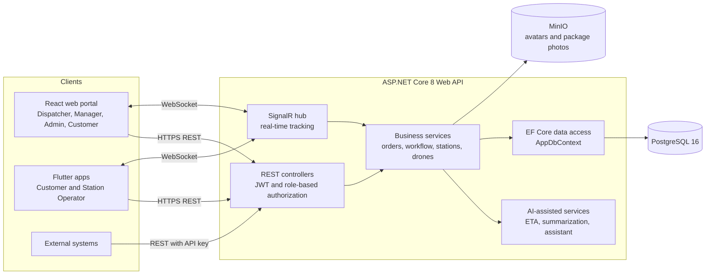

# Architecture and Team Conventions - SmartDroneDelivery

## 1. System architecture



The SignalR hub, business services and AI-assisted services are delivered in later sprints. The API project, EF Core data access, PostgreSQL and MinIO exist today.

## 2. Components and technology

| Component | Technology | Location |
|---|---|---|
| Web API | ASP.NET Core 8, EF Core 8, Npgsql, BCrypt, Swagger | `backend/SmartDroneDelivery.Api` |
| Database | PostgreSQL 16 (Docker, host port 5433) | `docker-compose.yml` |
| File storage | MinIO (Docker, ports 9000 and 9001) | `docker-compose.yml` |
| Web portal | React, TypeScript, Vite, Ant Design, React Router, Axios | `frontend/web` |
| Mobile apps | Flutter, Riverpod, Dio, go_router, secure storage; Clean Architecture | `frontend/mobile` |
| Real time | SignalR (planned, Sprint 6) | backend |
| Deployment | Docker Compose (full stack in Sprint 8) | repository root |

Flutter details are in `frontend/mobile/docs` (architecture, state management and dependency injection, HTTP client).

## 3. Repository layout

```
backend/SmartDroneDelivery.Api/   Controllers, Data (DbContext, seed), Entities, Migrations
frontend/web/                     React web portal
frontend/mobile/                  Flutter apps (customer and operator entry points)
docs/requirements/                SRS and use cases
docs/architecture/                this document, ERD
docker-compose.yml                PostgreSQL and MinIO for local development
```

## 4. Local development

| Item | Value |
|---|---|
| Start infrastructure | `docker compose up -d` |
| API address | `http://localhost:5055` (Swagger at `/swagger` in Development) |
| Web API base URL | `VITE_API_BASE_URL` in `frontend/web/.env` (see `.env.example`) |
| Create a migration | `dotnet ef migrations add <Name>` inside `backend/SmartDroneDelivery.Api` |
| Apply migrations | applied automatically at API start by `SeedData.InitializeAsync` |

Secrets and local settings are never committed; `.env` files are ignored by git.

## 5. API conventions

- RESTful resources in plural kebab-case: `/api/delivery-orders`, `/api/landing-stations`.
- Standard verbs: `GET` read, `POST` create, `PUT` or `PATCH` update, `DELETE` remove.
- JSON bodies use camelCase; identifiers are UUIDs except `roles` (integer).
- Authentication with `Authorization: Bearer <access token>`; clients refresh on `401` using the refresh token.
- Errors return a problem-details JSON with a clear message; validation errors use `400`, missing authentication `401`, missing permission `403`, unknown resource `404`.
- Lists are paginated with `page` and `pageSize` and can be filtered by query parameters.
- Every endpoint is documented in Swagger and protected by role.

## 6. Git workflow (GitHub Flow with a `develop` branch)

1. `main` holds stable releases; `develop` is the integration branch. Nobody commits directly to either.
2. Each Jira issue is developed on its own branch created from `develop`:
   `feature/LA-<number>-<short-description>`, for example `feature/LA-10-add-missing-entities`.
3. The commit message starts with the Jira key, followed by a short imperative summary and the subtask range:
   `LA-10: Add CustomerAddress and Notification entities with migration (LA-65 to LA-67)`.
   Commits are made with the author's own name and email.
4. Push the branch and open a pull request into **`develop`**. The title is the commit message, for example `LA-10: Add CustomerAddress and Notification entities with migration (LA-65 to LA-67)`.
5. The pull request needs a green build and lint, and the leader's approval.
6. Merge with a merge commit, then **delete the feature branch** on GitHub and locally.
7. Update `develop` before starting the next issue: `git checkout develop && git pull origin develop`.
8. At the end of a sprint, `develop` is merged into `main` and tagged, for example `v0.1.0`.

## 7. Jira conventions

| Item | Convention |
|---|---|
| Hierarchy | Epic (work package) → Story or Task → Subtask |
| Sprint | Two weeks; goal written as one line |
| Subtask names | Prefixed `[Backend]`, `[Web]`, `[Mobile]` or `[Test]` when they belong to one layer |
| Labels | `backend`, `web`, `mobile`, `ai`, `docs`, `devops`, `testing`, `integration` |
| Definition of Done | Code builds and lints, basic tests pass, pull request approved by the leader, commit message starts with the Jira key |
