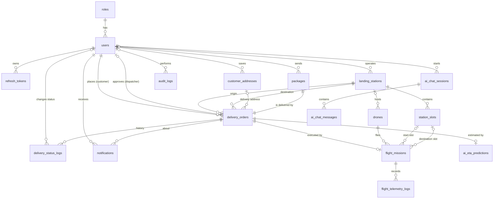

# Entity Relationship Diagram - SmartDroneDelivery

The database has **17 tables** in PostgreSQL, mapped by EF Core in `backend/SmartDroneDelivery.Api/Data/AppDbContext.cs`. The full column definition is in [erd.dbml](erd.dbml); paste it into https://dbdiagram.io to see the interactive diagram. This page shows the relationships.

## Diagram

## Tables by module

| Module | Tables |
|---|---|
| Authentication and RBAC | `roles`, `users`, `refresh_tokens` |
| Landing station infrastructure | `landing_stations`, `station_slots` |
| Packages and delivery workflow | `customer_addresses`, `packages`, `delivery_orders`, `delivery_status_logs`, `notifications` |
| Real-time flight and telemetry | `drones`, `flight_missions`, `flight_telemetry_logs` |
| AI services and audit | `ai_eta_predictions`, `ai_chat_sessions`, `ai_chat_messages`, `audit_logs` |

## Status values

| Column | Values |
|---|---|
| `users.status` | ACTIVE, INACTIVE, SUSPENDED |
| `landing_stations.status` | OPERATIONAL, MAINTENANCE, OFFLINE |
| `station_slots.status` | EMPTY, OCCUPIED, RESERVED, ERROR |
| `delivery_orders.status` | PENDING, APPROVED, READY_FOR_TAKEOFF, IN_TRANSIT, ARRIVED, DELIVERED, CANCELLED, FAILED |
| `drones.status` | IDLE, ASSIGNED, FLYING, CHARGING, MAINTENANCE |
| `flight_missions.flight_status` | PLANNED, IN_AIR, COMPLETED, ABORTED |
| `ai_chat_messages.sender_type` | USER, BOT |

## Design notes

- **Keys:** `roles` uses an integer key; most other tables use UUIDs. Log tables (`delivery_status_logs`, `flight_telemetry_logs`, `ai_chat_messages`, `audit_logs`) use `bigint` identity keys because they grow fast.
- **One package, one order:** `delivery_orders.package_id` is unique, so a package belongs to at most one order. `flight_missions.order_id` is also unique: one order has at most one mission.
- **Delete behavior:** child data of a user or order (tokens, addresses, status logs, telemetry, AI predictions, chat, and the notifications of a user) is deleted with its parent. Business records (orders, packages, missions) use `RESTRICT` so they cannot be removed by accident. References to staff (dispatcher, operator, log author) use `SET NULL` to keep history when an account is removed.
- **Indexes for the common queries:** `(station_id, slot_number)` unique, `(mission_id, timestamp)` for telemetry replay, `(user_id, is_read)` for unread notifications, and unique indexes on email, phone, tracking number, serial number and station code.
- **Added by LA-10:** `customer_addresses`, `notifications` and the optional `delivery_orders.delivery_address_id`, to cover "manage customers and delivery addresses" and status notifications from the requirements.
- **Known difference from the first design:** in the first ERD `ai_eta_predictions.order_id` was a plain many-to-one reference. The EF Core model maps it as one-to-one (one current prediction per order). If predictions must be kept as history, change the relationship to one-to-many in a future migration.
