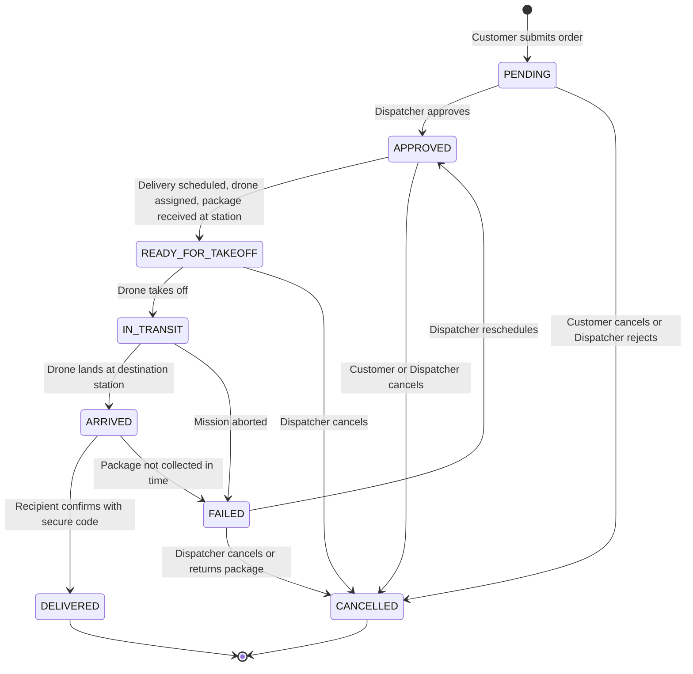
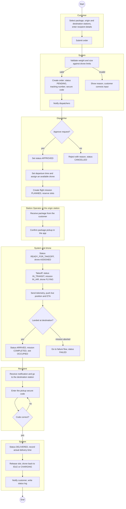
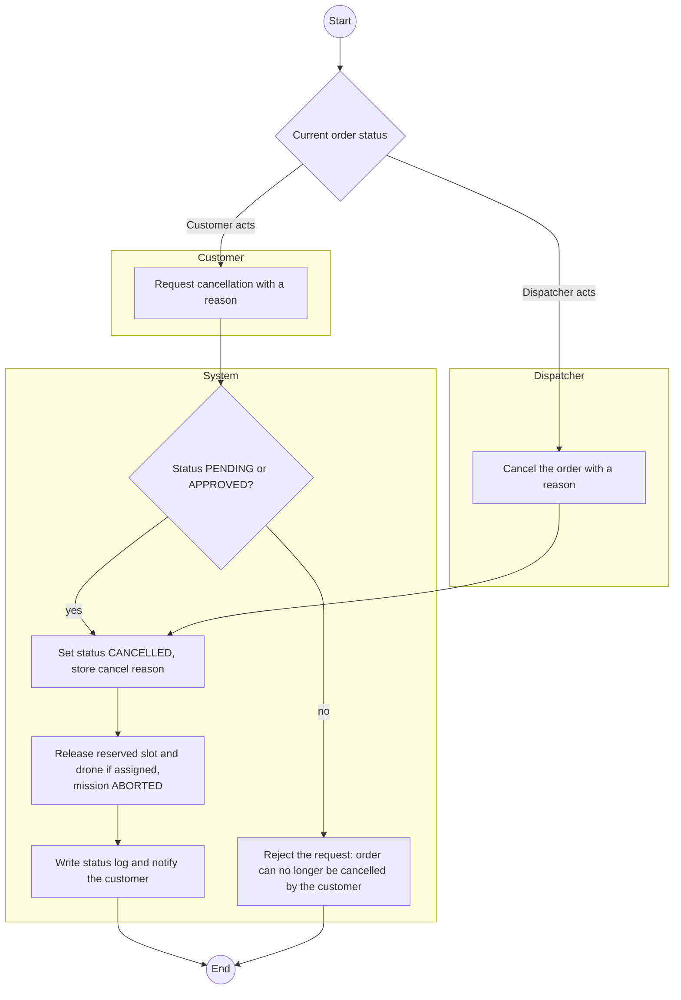
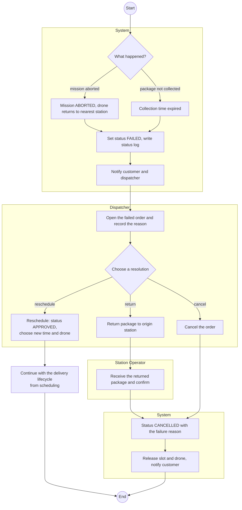

# Business Process Models - SmartDroneDelivery

Models of the drone delivery business processes: the delivery lifecycle (LA-70) and the cancellation and failure flows (LA-71). They use the actors of [use-cases.md](../requirements/use-cases.md) and the status values of [erd.md](../architecture/erd.md).

The diagrams are drawn in Mermaid (rendered by GitHub) because the tool has no native BPMN. Swimlanes show who performs each step.

> **Proposed rules.** The status values come from the ERD. The transition and cancellation rules below are proposed by this document and must be reviewed by the team. Open points are listed at the end.

## 1. Order status model

`delivery_orders.status` takes one of eight values.

| Status | Meaning | Who can move the order out |
|---|---|---|
| PENDING | Created by the customer, waiting for review | Dispatcher, Customer (cancel) |
| APPROVED | Accepted, waiting for schedule and drone | Dispatcher, Station Operator, Customer (cancel) |
| READY_FOR_TAKEOFF | Drone assigned and package loaded | System (takeoff), Dispatcher (cancel) |
| IN_TRANSIT | Drone is flying | System |
| ARRIVED | Drone landed at the destination station | Recipient, System (timeout) |
| DELIVERED | Recipient confirmed receipt (final) | none |
| CANCELLED | Stopped before completion (final) | none |
| FAILED | A delivery attempt failed, waiting for a decision | Dispatcher |

## 2. Delivery lifecycle (LA-70)

The normal flow from the customer's request to the confirmation of delivery.

### Effects of each step

| Step | Order | Mission | Drone | Slot | Notification and log |
|---|---|---|---|---|---|
| Order submitted | PENDING | none | none | none | Log entry, notify dispatchers |
| Approved | APPROVED | none | none | none | Log entry, notify customer |
| Scheduled and drone assigned | APPROVED | PLANNED | ASSIGNED | destination slot RESERVED | Log entry |
| Pickup confirmed | READY_FOR_TAKEOFF | PLANNED | ASSIGNED | origin slot OCCUPIED | Log entry, notify customer |
| Takeoff | IN_TRANSIT | IN_AIR | FLYING | origin slot EMPTY | Log entry, live tracking starts |
| Landing | ARRIVED | COMPLETED | CHARGING or IDLE | destination slot OCCUPIED | Log entry, notify recipient |
| Delivery confirmed | DELIVERED | COMPLETED | IDLE | destination slot EMPTY | Log entry, notify customer |

## 3. Cancellation flow (LA-71)

| Status when cancelled | Customer | Dispatcher | Result |
|---|---|---|---|
| PENDING | allowed | allowed (reject) | CANCELLED |
| APPROVED | allowed | allowed | CANCELLED, planned mission aborted |
| READY_FOR_TAKEOFF | not allowed | allowed | CANCELLED, package returned to the customer at the station |
| IN_TRANSIT, ARRIVED | not allowed | not allowed | handled as a failure when needed |
| DELIVERED, CANCELLED | not allowed | not allowed | final |

## 4. Failed delivery flow (LA-71)

A delivery fails when the mission is aborted in the air (weather, low battery, technical fault) or when the package is not collected after arrival within the allowed time.

## 5. Link to use cases and requirements

| Process | Use cases | Requirements |
|---|---|---|
| Delivery lifecycle | UC-05, UC-11, UC-12, UC-18, UC-07, UC-08 | FR-08, FR-09, FR-13 to FR-15, FR-23, FR-24, FR-26, FR-27 |
| Cancellation | UC-06, UC-11 | FR-10, FR-14 |
| Failed delivery | UC-14 | FR-18 |

## 6. Open points for team review

1. **Return to origin.** The status list has no RETURNED value, so a returned package ends as CANCELLED with the reason recorded. Add a status only if the team needs to report returns separately.
2. **Cancellation window.** The customer may cancel in PENDING and APPROVED. Confirm that cancellation after READY_FOR_TAKEOFF is dispatcher-only.
3. **Collection timeout.** The time allowed before an ARRIVED order becomes FAILED is not defined yet.
4. **Slot reservation point.** The diagram reserves the destination slot when the drone is assigned. Confirm whether the origin slot should be reserved too.
5. **Automatic transitions.** IN_TRANSIT and ARRIVED are driven by telemetry. The rule that decides "landed" must be defined with the drone data source.
