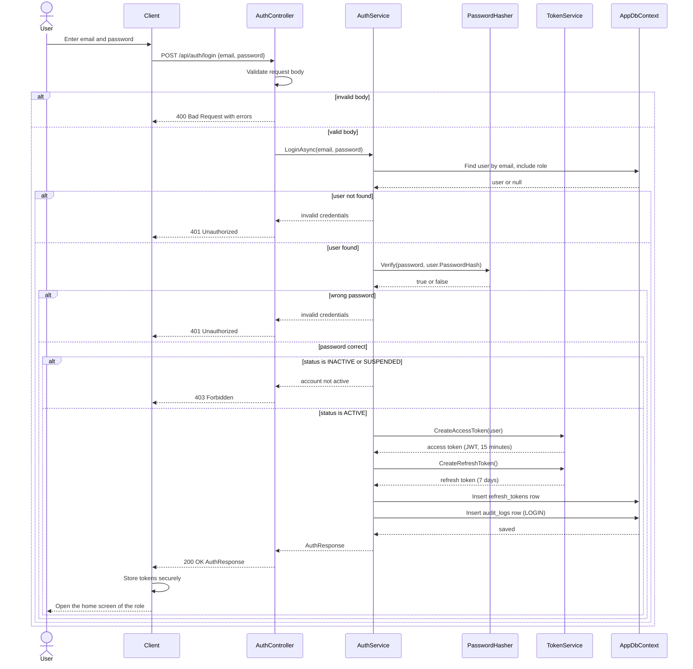
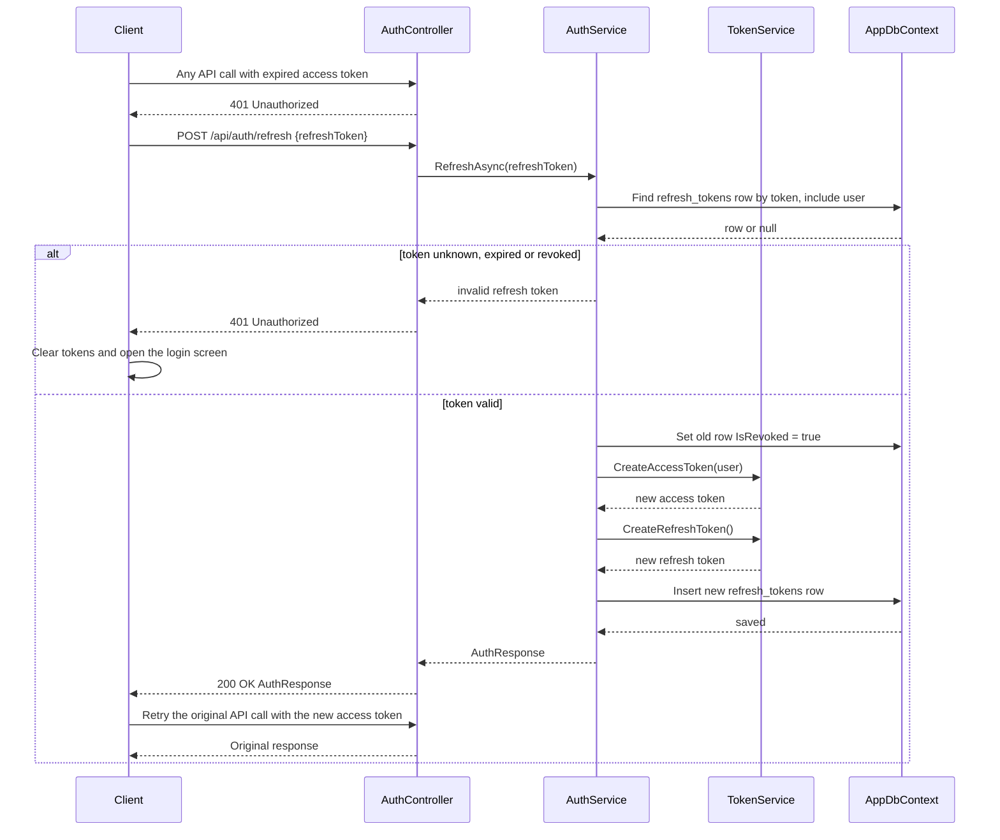
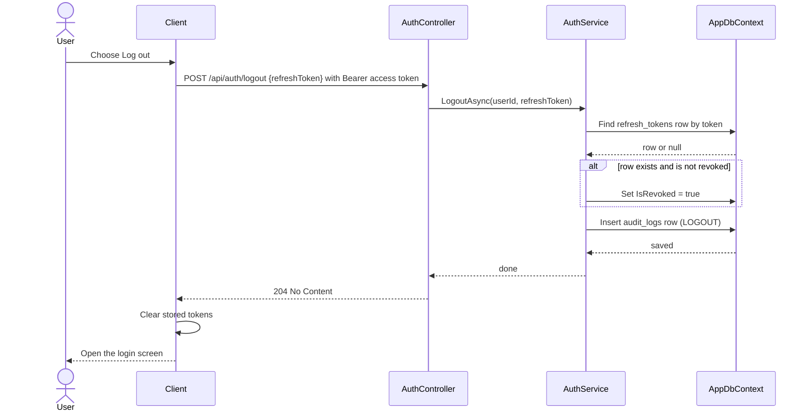

# Sequence Diagrams - Authentication

Sequence diagrams of the authentication use cases, following the [API contract](../api/auth-api.md) and the entities `User`, `Role` and `RefreshToken`.

> **Proposed class names.** The participants below (`AuthController`, `AuthService`, `TokenService`, `PasswordHasher`, `AppDbContext`) are the proposed classes of the authentication module. The class diagram of the same module (LA-222) must use the same names.

## Participants

| Participant | Role |
|---|---|
| Client | Web portal (React) or mobile app (Flutter) |
| AuthController | ASP.NET Core controller exposing `/api/auth/*` |
| AuthService | Business logic of login, refresh and logout |
| PasswordHasher | BCrypt hashing and verification |
| TokenService | Creates and validates JWT access tokens and refresh tokens |
| AppDbContext | EF Core access to the tables `users`, `roles`, `refresh_tokens`, `audit_logs` |

## 1. Login (LA-223)

Notes:
- Wrong email and wrong password return the same `401` message so the response does not reveal which accounts exist.
- The web portal keeps the tokens in browser storage chosen in the web design; the Flutter apps use secure storage.

## 2. Token refresh and logout (LA-224)

### 2.1 Refresh an expired access token

Notes:
- The client refreshes once per expiry. If several calls fail with `401` at the same time, they wait for the same refresh and then retry.
- Rotating the refresh token means a stolen old token stops working after the legitimate client refreshes.

### 2.2 Logout

Notes:
- Logout returns `204` even if the token is unknown or already revoked, so retrying is safe.
- The short-lived access token is not stored on the server; it expires by itself within 15 minutes.

## 3. Link to use cases and requirements

| Diagram | Use case | Requirements |
|---|---|---|
| Login | UC-01 | FR-01, FR-02, FR-03 |
| Refresh and logout | UC-01 | FR-02, FR-32 |
