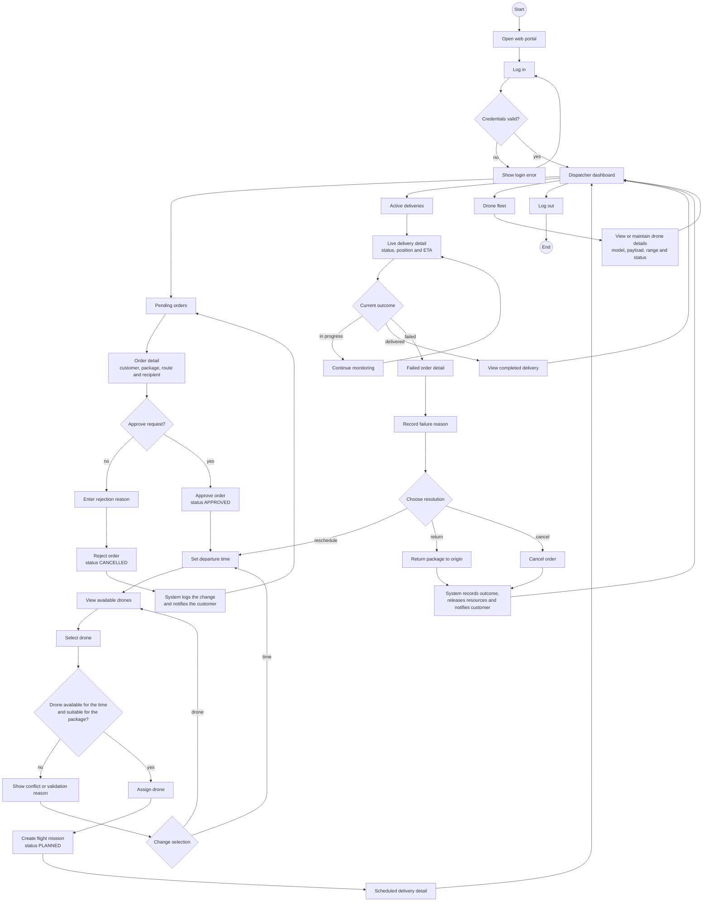

# Dispatcher User Flow - SmartDroneDelivery

Screen flow for the Dispatcher web portal. It covers reviewing delivery requests, scheduling deliveries, assigning drones, monitoring active deliveries and handling failures.

The flow uses the Dispatcher use cases in [use-cases.md](../../requirements/use-cases.md), the lifecycle rules in [business-processes.md](../business-processes.md) and the status values in [erd.md](../../architecture/erd.md).

## User flow

## Main screens and decisions

| Screen or decision | Purpose | Related use case |
|---|---|---|
| Dispatcher dashboard | Entry point for pending orders, active deliveries, failed deliveries and the drone fleet | UC-11 to UC-15 |
| Pending orders | List delivery requests with status `PENDING` | UC-11 |
| Order detail | Review customer, package, origin, destination and recipient information | UC-11 |
| Approve request? | Approve the request or reject it with a reason | UC-11 |
| Schedule and drone selection | Set departure time and select a suitable available drone | UC-12 |
| Active deliveries | Follow current mission status, position and ETA | UC-13, UC-20 |
| Failed order resolution | Reschedule, return the package or cancel the order | UC-14 |
| Drone fleet | Maintain model, payload capacity, range and operational status | UC-15 |

## Flow rules

- Approving an order changes it from `PENDING` to `APPROVED`; rejecting it records a reason and ends it as `CANCELLED`.
- A schedule is not confirmed when the selected drone is already booked for that time or is not suitable for the package.
- A successful assignment creates one `PLANNED` flight mission linked to the order.
- Active-delivery monitoring shows the current status, live position and AI-estimated arrival time.
- A failed delivery remains `FAILED` until the Dispatcher chooses to reschedule, return or cancel it.
- Every order decision and status change is recorded and the customer is notified where required by the delivery process.
