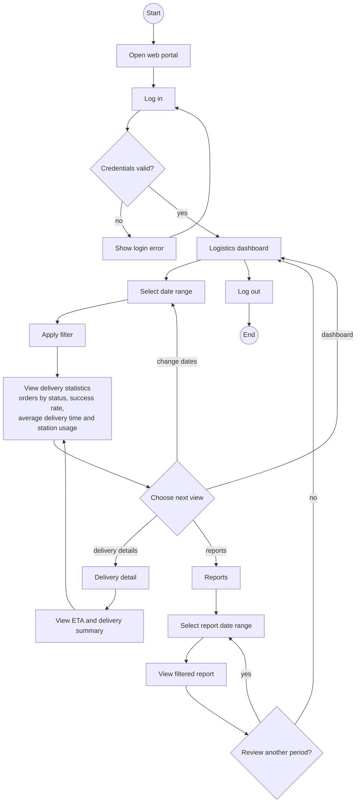

# Logistics Manager User Flow - SmartDroneDelivery

Screen flow for the Logistics Manager web portal. It covers the operational dashboard, date filters and delivery reports.

The flow uses the Logistics Manager use cases in [use-cases.md](../../requirements/use-cases.md) and the dashboard requirements in [SRS.md](../../requirements/SRS.md).

## User flow

## Main screens and information

| Screen | Information or action | Related use case |
|---|---|---|
| Logistics dashboard | Overview of delivery performance | UC-19 |
| Date filter | Limit dashboard statistics to the selected reporting period | UC-19 |
| Delivery statistics | Orders by status, success rate, average delivery time and station usage | UC-19 |
| Delivery detail | Inspect one delivery from the dashboard or report | UC-20 |
| ETA and delivery summary | View the AI-estimated arrival time and generated delivery summary | UC-20 |
| Reports | Review delivery performance for a selected date range | UC-19 |

## Flow rules

- Dashboard metrics are recalculated for the selected date range.
- The dashboard presents the four measures defined by the requirements: orders by status, success rate, average delivery time and station usage.
- Selecting a delivery opens its details without changing operational data.
- Reports are read-only views of delivery performance for the selected period.
- The Logistics Manager monitors and analyses operations; approval, scheduling and administration actions stay with their assigned roles.
