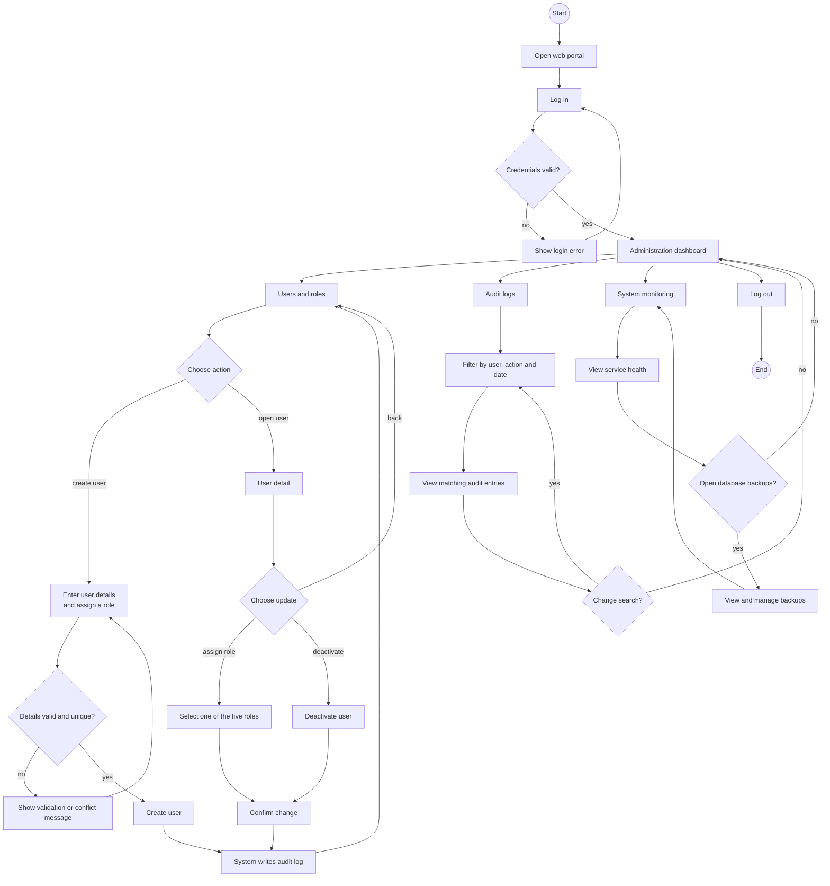

# System Administrator User Flow - SmartDroneDelivery

Screen flow for the System Administrator web portal. It covers user and role management, audit-log review, system health monitoring and database backups.

The flow uses the System Administrator use cases in [use-cases.md](../../requirements/use-cases.md), the administration requirements in [SRS.md](../../requirements/SRS.md) and the role model in [auth-api.md](../../api/auth-api.md).

## User flow

## Main screens and decisions

| Screen or decision | Purpose | Related use case |
|---|---|---|
| Administration dashboard | Entry point for users, audit logs and system monitoring | UC-21 to UC-23 |
| Users and roles | Find staff or customer accounts and open their details | UC-21 |
| Create user | Create a staff account and assign a role | UC-21 |
| User detail | Assign a role or deactivate an account | UC-21 |
| Audit logs | Search sensitive actions by user, action and date | UC-22 |
| System monitoring | Check service health | UC-23 |
| Database backups | View and manage database backups | UC-23 |

## Flow rules

- Public registration creates Customers; staff accounts are created by a System Administrator.
- A user is assigned one of five roles: Customer, Dispatcher, Station Operator, Logistics Manager or System Administrator.
- User creation must reject invalid details and duplicate email addresses or phone numbers.
- Deactivation changes the account status rather than deleting its business history.
- User creation, role changes and account deactivation are sensitive actions and must be written to the audit log.
- Audit logs are searchable by user, action and date and are read-only in this flow.
- System monitoring covers service health and database backups as defined by the administration use case.
