# Use Cases - SmartDroneDelivery

Use cases for the five human actors of the AI-powered Drone Delivery Management Platform. The platform manages drone **delivery operations**, not drone flight control.

## Actors

| Actor | Role in the system |
|---|---|
| Customer | Creates and tracks delivery orders, manages addresses and packages |
| Dispatcher | Approves delivery requests, schedules deliveries and assigns drones |
| Station Operator | Operates a landing station, confirms package pickup and slot status |
| Logistics Manager | Monitors performance through the dashboard, statistics and reports |
| System Administrator | Manages users, roles, audit logs and system settings |

## Use case diagram

```mermaid
flowchart LR
    Customer(["Customer"])
    Dispatcher(["Dispatcher"])
    Operator(["Station Operator"])
    Manager(["Logistics Manager"])
    Admin(["System Administrator"])

    subgraph G0["Common"]
        UC01["UC-01 Log in / log out"]
        UC02["UC-02 Manage profile"]
    end

    subgraph G1["Customer and Delivery Order Management"]
        UC03["UC-03 Manage delivery addresses"]
        UC04["UC-04 Manage packages"]
        UC05["UC-05 Create delivery order"]
        UC06["UC-06 Update / cancel delivery order"]
        UC07["UC-07 Track delivery order"]
        UC08["UC-08 Confirm delivery with secure code"]
        UC09["UC-09 Chat with AI assistant"]
        UC10["UC-10 View notifications"]
    end

    subgraph G2["Delivery Workflow"]
        UC11["UC-11 Review and approve / reject request"]
        UC12["UC-12 Schedule delivery and assign drone"]
        UC13["UC-13 Monitor active deliveries"]
        UC14["UC-14 Handle failed delivery"]
        UC15["UC-15 Manage drones"]
    end

    subgraph G3["Landing Station Management"]
        UC16["UC-16 Manage landing stations and slots"]
        UC17["UC-17 Monitor station availability"]
        UC18["UC-18 Confirm package pickup"]
    end

    subgraph G4["Analytics and AI Services"]
        UC19["UC-19 View dashboard and reports"]
        UC20["UC-20 View ETA and delivery summary"]
    end

    subgraph G5["Administration"]
        UC21["UC-21 Manage users and roles"]
        UC22["UC-22 View audit logs"]
        UC23["UC-23 Monitor system and backup"]
    end

    Customer --- UC01 & UC02 & UC03 & UC04 & UC05 & UC06 & UC07 & UC08 & UC09 & UC10 & UC20
    Dispatcher --- UC01 & UC02 & UC11 & UC12 & UC13 & UC14 & UC15 & UC20
    Operator --- UC01 & UC02 & UC16 & UC17 & UC18
    Manager --- UC01 & UC02 & UC19 & UC20
    Admin --- UC01 & UC02 & UC21 & UC22 & UC23 & UC16
```

## Use case catalog

| Id | Use case | Primary actor | Short description |
|---|---|---|---|
| UC-01 | Log in / log out | All | Authenticate with email and password, receive access and refresh tokens, end the session |
| UC-02 | Manage profile | All | View and edit personal details, change password, upload avatar |
| UC-03 | Manage delivery addresses | Customer | Create, edit, delete and select a default delivery address |
| UC-04 | Manage packages | Customer | Register package name, weight, dimensions, fragile flag and photo |
| UC-05 | Create delivery order | Customer | Choose a package, origin and destination, enter recipient details and submit |
| UC-06 | Update / cancel delivery order | Customer | Edit an order that is not yet approved, or cancel with a reason |
| UC-07 | Track delivery order | Customer | See status history, ETA and live position of the drone |
| UC-08 | Confirm delivery with secure code | Customer (recipient) | Enter the pickup secure code to complete the delivery |
| UC-09 | Chat with AI assistant | Customer | Ask about orders and the service; the assistant answers from the customer's own data |
| UC-10 | View notifications | Customer | Read status-change notifications and mark them as read |
| UC-11 | Review and approve / reject request | Dispatcher | Inspect a pending order and approve it or reject it with a reason |
| UC-12 | Schedule delivery and assign drone | Dispatcher | Set a departure time and assign an available drone to create a flight mission |
| UC-13 | Monitor active deliveries | Dispatcher | Follow all missions in progress with status and position |
| UC-14 | Handle failed delivery | Dispatcher | Record the failure reason and choose reschedule, return or cancel |
| UC-15 | Manage drones | Dispatcher | Maintain the fleet: model, payload, range and status |
| UC-16 | Manage landing stations and slots | Station Operator, Administrator | Maintain stations, their location, operating status and slots |
| UC-17 | Monitor station availability | Station Operator | See free and occupied slots of the station |
| UC-18 | Confirm package pickup | Station Operator | Confirm that a package was handed over at the station |
| UC-19 | View dashboard and reports | Logistics Manager | See delivery statistics, success rate and average delivery time with filters |
| UC-20 | View ETA and delivery summary | Customer, Dispatcher, Manager | See the AI-estimated arrival time and an AI-generated summary of a delivery |
| UC-21 | Manage users and roles | System Administrator | Create, deactivate users and assign one of the five roles |
| UC-22 | View audit logs | System Administrator | Search the audit trail of sensitive actions |
| UC-23 | Monitor system and backup | System Administrator | Check service health and manage database backups |

## Key use case specifications

### UC-05 Create delivery order

| Item | Description |
|---|---|
| Actor | Customer |
| Precondition | Customer is logged in and has at least one package |
| Trigger | Customer chooses "Create delivery order" |
| Main flow | 1. Customer selects a package. 2. Customer selects the origin and destination landing stations. 3. Customer enters recipient name and phone. 4. System validates package weight and size against drone limits. 5. System creates the order with status PENDING, a unique tracking number and a pickup secure code. 6. System notifies the customer. |
| Alternative flow | 4a. Validation fails: the system shows the reason and the customer corrects the input. |
| Postcondition | A PENDING order exists and is visible to dispatchers |

### UC-11 Review and approve / reject request

| Item | Description |
|---|---|
| Actor | Dispatcher |
| Precondition | At least one order is PENDING |
| Main flow | 1. Dispatcher opens the pending list. 2. Dispatcher opens an order. 3. Dispatcher approves it. 4. System records the status change and notifies the customer. |
| Alternative flow | 3a. Dispatcher rejects the order and enters a reason; the system records it and notifies the customer. |
| Postcondition | The order is approved or rejected and the change is logged |

### UC-12 Schedule delivery and assign drone

| Item | Description |
|---|---|
| Actor | Dispatcher |
| Precondition | The order is approved and at least one drone is available |
| Main flow | 1. Dispatcher chooses an approved order. 2. Dispatcher sets the departure time. 3. Dispatcher selects an available drone. 4. System creates a flight mission and stores the scheduled time on the order. |
| Alternative flow | 3a. The drone is already booked in that time range: the system refuses and asks for another drone or time. |
| Postcondition | A flight mission is linked to the order |

### UC-18 Confirm package pickup

| Item | Description |
|---|---|
| Actor | Station Operator |
| Precondition | The order is scheduled and the package arrived at the origin station |
| Main flow | 1. Operator finds the order by tracking number. 2. Operator confirms the package was received. 3. System updates the slot and the order status and logs the action. |
| Postcondition | The order moves to the next delivery state |

### UC-08 Confirm delivery with secure code

| Item | Description |
|---|---|
| Actor | Recipient (through the Customer or Operator app) |
| Precondition | The drone has arrived at the destination station |
| Main flow | 1. Recipient enters the pickup secure code. 2. System verifies the code. 3. System completes the order and records the actual delivery time. |
| Alternative flow | 2a. The code is wrong: the system rejects it and counts the attempt. |
| Postcondition | The order is completed |

### UC-14 Handle failed delivery

| Item | Description |
|---|---|
| Actor | Dispatcher |
| Precondition | A delivery attempt failed |
| Main flow | 1. Dispatcher opens the failed order. 2. Dispatcher records the reason. 3. Dispatcher chooses to reschedule, return to origin or cancel. 4. System applies the choice, logs it and notifies the customer. |
| Postcondition | The order has a recorded outcome |

The exact order status values and transitions are defined in the business process models (LA-12) and implemented by the order state machine in Sprint 5.
